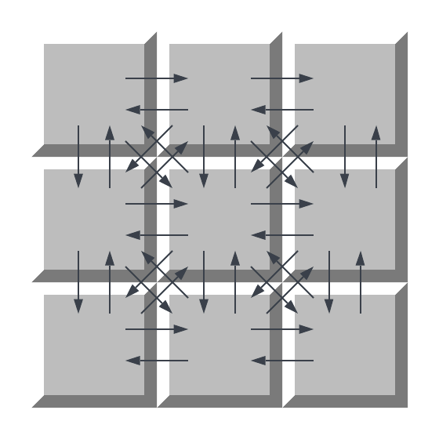
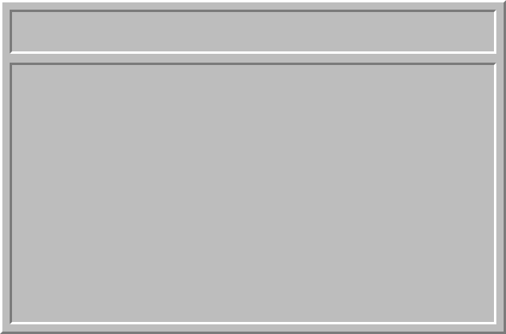
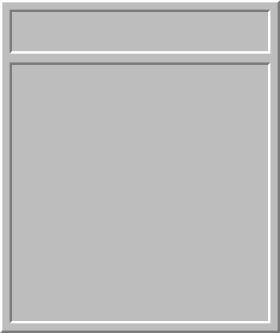
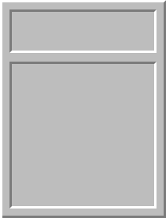

## Minesweeper

Minesweeper is a Go implementation of [Microsoft Minesweeper](https://en.wikipedia.org/wiki/Microsoft_Minesweeper)
using [communicating sequential processes (CSP)](https://en.wikipedia.org/wiki/Communicating_sequential_processes).

Each game tile is an independent, anonymous process and _all_ communication occurs via channels.
No explicit synchronization primitives are used beyond channels.



## Goroutines

Minesweeper Goroutines:

* `T[R,C]` - Tile in row `R`, column `C`: handles cell input events and notifies neighbors
* `G` - The game engine: main game loop with win-loss logic
* `W` - The window GUI component: presents game state in 
* `C` - The game clock: emits tick event periodically

Goroutines communicate via channels as follows:

* `T[R][C]` -> `T[R-1][C-1]`, `T[R-1][C]`, ... - Cell tells neighbors about state change
* `T[R][C]` -> `G` - Cell tells game about state change
* `G` -> `T[R][C]` - Game tells cell about user input
* `G` -> `W` - Game tells window about game state change
* `W` -> `G` - Window tells game about mouse click
* `C` -> `G` - Clock tells game about clock tick

## Build

Minesweeper Go depends on [go-sdl2](https://github.com/veandco/go-sdl2), a Go wrapper for SDL2.

As noted in the [go-sdl2](https://github.com/veandco/go-sdl2#requirements) documentation, the SDL2 system library
must be installed.

### Docker

Docker can be used with X Window System to build and run Minesweeper without
installing libraries directly.

The following command launches a bash shell in a Golang Docker container.
```bash
docker run -it --rm --name go -v "$PWD":/usr/src/golang -w /usr/src/golang golang:bookworm bash
```

The command below installs SDL2 and SDL2-image within the container:
```bash
apt-get install -y libsdl2-dev libsdl2-image-dev
```

Configure X11 display:
```bash
export DISPLAY=host.docker.internal:0
```

On my system running MacOS, I did the following to establish a suitable X11 server:
* Install XQuartz (version 2.8.5) `brew install xquartz`
* Edit XQuartz settings to "Allow connections from network clients"
* Run command `defaults write org.xquartz.X11 enable_iglx -bool true` to allow OpenGL drawing
* Run XQuartz
* Run command `xhost + 127.0.0.1` to ensure localhost is allowed X11 forwarding

## Command Line Arguments

Include `Beginner`, `Intermediate`, or `Advanced` command-line argument to select a difficulty.

| Difficulty   | Rows | Columns | Mines | Mine Density |
|--------------| ---- |---------|-------| ------------ |
| Beginner     | 9    | 9       | 10    | 12%          |
| Intermediate | 16   | 16      | 40    | 16%          |
| Advanced     | 16   | 30      | 99    | 21%          |

## Assets

All game assets were created from scratch in [Inkscape](https://inkscape.org/) and rasterized to PNG images.

         

           

  

  